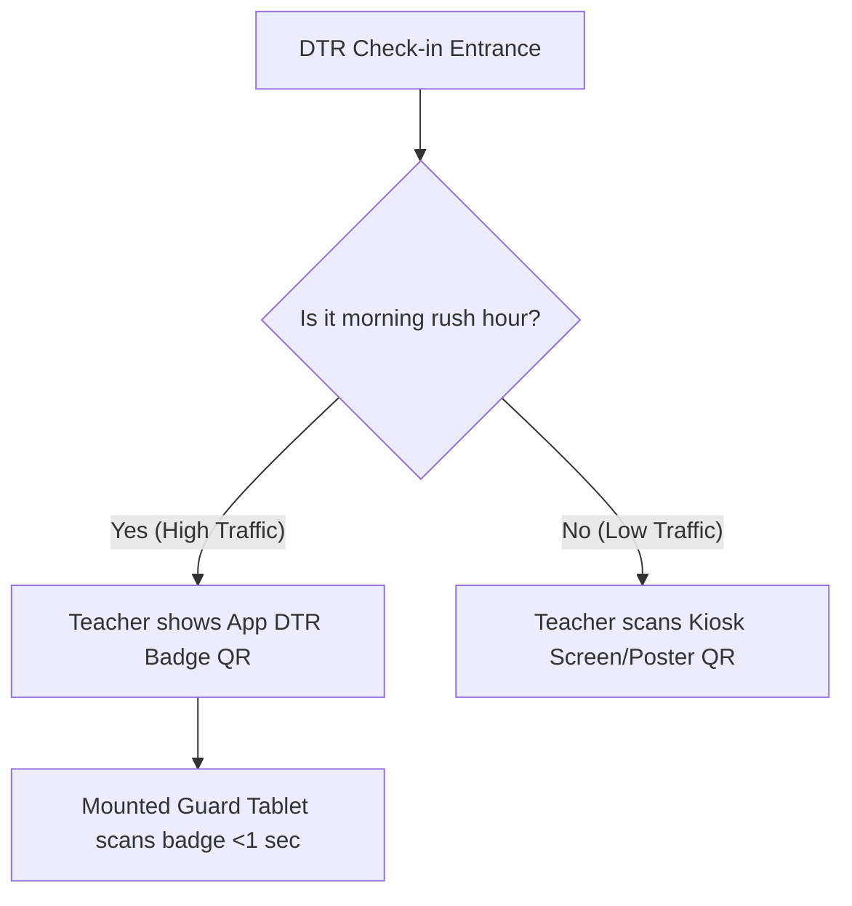
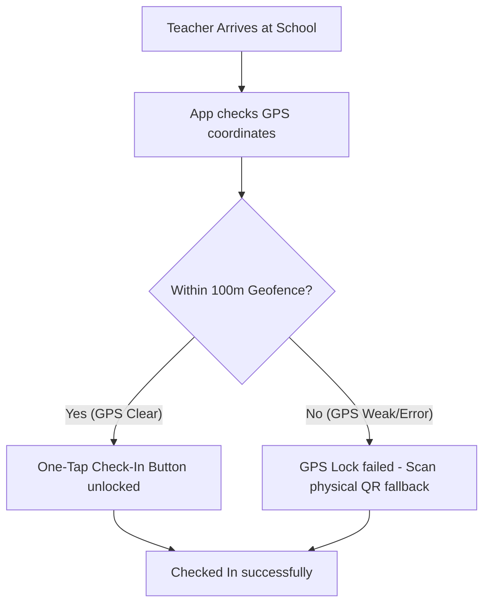

# Attendance QR Code Usability & Flow Design Plan

This document outlines strategic architecture options to incorporate QR-based daily time records (DTR) in the DepEd HRIS system while maintaining high usability, preventing queues during rush hour, and maintaining project compliance.

---

## The Usability Dilemma

In standard school environments, morning check-in creates two main bottlenecks:
1. **If QR is displayed on the wall (Self-Service Scan)**: Teachers queue to launch their phone cameras, lock GPS, and scan the QR code. This results in slow check-ins and queues.
2. **If QR is displayed on the teacher's phone (Station Scanner)**: Guards or mounted tablets scan the teacher's screen. If the teacher's app is slow to load or they have trouble finding their badge, delays still occur.

---

## Proposed Architectural Solutions

### Option 1: The "Dual-Directional" QR System (Hybrid Mode)
This option supports two distinct modes of check-in depending on traffic conditions at the school entrance.

| Check-in Mode | User Actions | Hardware Required | Usability Impact |
| :--- | :--- | :--- | :--- |
| **Self-Service Scan** | Teacher opens camera inside PWA app and scans the school's static or dynamic QR code. | None (static paper poster or office monitor). | Suitable for off-peak times or late arrivals. |
| **Express Badge Scan** | Teacher opens their PWA home screen showing their **DTR QR Badge**. They flash it under a mounted scanner/tablet. | 1 tablet or smartphone mounted at the entrance. | **Extremely Fast (<1s)**. Zero focus delays. Works even with slow mobile data. |

---

### Option 2: Geofence-Unlocked "One-Tap Check-In" with QR Fallback
Leverage geospatial coordinate validation (Haversine formula) to bypass physical scanning during optimal conditions, using QR codes as a secondary verification factor.

- **Standard Check-In (90% of cases)**: The teacher walks into the school yard. The app recognizes they are within the geofenced boundary and unlocks a **"Tap to Check-In"** button. The check-in takes **3 seconds** and can be done while walking.
- **QR Fallback (10% of cases)**: If GPS accuracy is degraded (e.g., inside concrete buildings), the user scans the printed QR code posted on the wall. The QR code contains an encrypted token that proves physical presence.

---

### Option 3: Progressive Web App (PWA) Optimizations
Ensure the DTR portal is built to load instantly, regardless of internet connectivity.

1. **Persistent Authentication (JWT)**: Keep teachers permanently logged in using secured LocalStorage tokens.
2. **Home Screen Action Shortcuts**: Install the app on the phone's home screen. Long-pressing the app icon opens a shortcut menu:
   - *Launch DTR Scanner*
   - *Display My DTR Badge*
3. **Offline Caching**: Pre-cache the DTR layout via service workers so the camera page loads instantly even with zero cellular signal at the school gates.

---

## Action Plan & Prototype Recommendations

For the upcoming prototype evaluation, we recommend implementing **Option 2 (One-Tap Check-in with QR Fallback)** because:
- It highlights both **GeoSpatial features** (Haversine geofence calculation) and **QR scanning capability** in the same demo.
- It provides a robust, seamless user experience that directly addresses the "rush hour queue" defense question.

### Next Steps:
- [ ] Add the DTR personal badge UI to the employee profile.
- [ ] Implement a quick fallback toggle in the scanner interface.
- [ ] Incorporate service worker caching for offline scanner usability.
