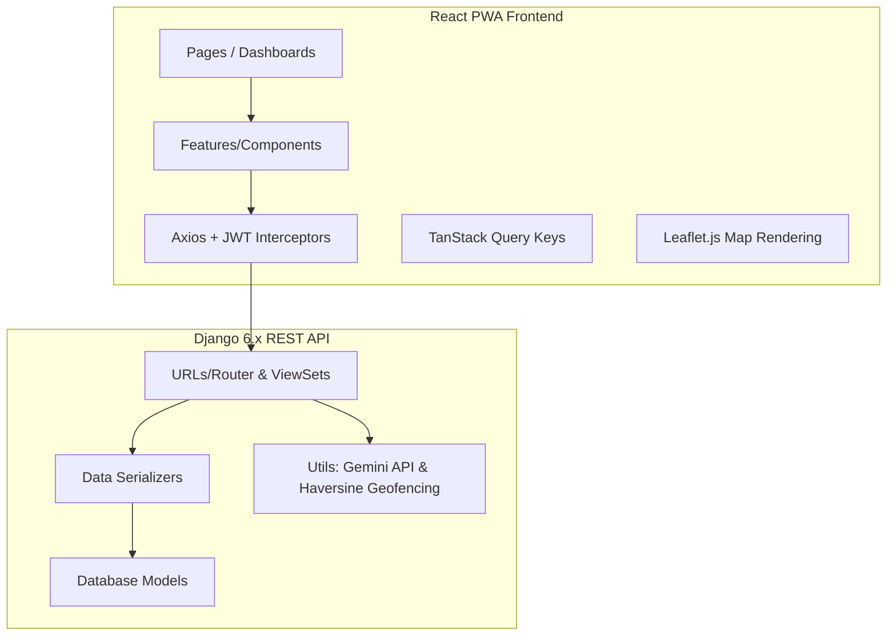

# CapstoneProjectHRIS: Codebase Overview

This project is a modern **Human Resource Information System (HRIS)** designed for **DepEd - Lucena City**. It consists of a Django-based REST API backend and a React-based Progressive Web App (PWA) frontend.

---

## 1. Backend Architecture (`backend/core/`)

The Django backend utilizes a highly modular directory structure matching features to specific domains:

### Database Models (`models/`)
*   **[employee.py](file:///c:/Users/jico/Documents/CapstoneProjectHRIS/backend/core/models/employee.py)**: Defines `User` (custom model with JWT auth), `Role` (Admin, HR Staff, Supervisor, Employee), `School` (geographical coordinates + geofencing radius), and `Employee` (salary, hire dates, and leave balances).
*   **[attendance.py](file:///c:/Users/jico/Documents/CapstoneProjectHRIS/backend/core/models/attendance.py)**: Defines `Attendance` logs, capturing scan coordinates (`latitude`/`longitude`), time-in/out, and status.
*   **[leave.py](file:///c:/Users/jico/Documents/CapstoneProjectHRIS/backend/core/models/leave.py)**: Defines `LeaveRequest` (Sick, Vacation, Emergency) and tracks durations.
*   **[loan.py](file:///c:/Users/jico/Documents/CapstoneProjectHRIS/backend/core/models/loan.py)**: Defines `ProvidentLoan` application parameters and `LoanPayment` ledgers.
*   **[payroll.py](file:///c:/Users/jico/Documents/CapstoneProjectHRIS/backend/core/models/payroll.py)**: Defines `Payroll` details, tracking semi-monthly cutoffs, earnings, and statutory deductions.
*   **[performance.py](file:///c:/Users/jico/Documents/CapstoneProjectHRIS/backend/core/models/performance.py)**: Defines `PerformanceReview` records containing IPCRF ratings.
*   **[audit.py](file:///c:/Users/jico/Documents/CapstoneProjectHRIS/backend/core/models/audit.py)**: Defines the system-wide security log (`AuditLog`).

### Logic & Routers (`views/`, `serializers/`, `utils.py`)
*   **[urls.py](file:///c:/Users/jico/Documents/CapstoneProjectHRIS/backend/core/urls.py)**: Exposes clean RESTful entry points mapped directly to ViewSets using DRF standard routers.
*   **[utils.py](file:///c:/Users/jico/Documents/CapstoneProjectHRIS/backend/core/utils.py)**: Houses utility scripts handling:
    1.  **AI Models**: Connects to the `google-genai` client using `gemini-2.0-flash` to write plain English employee performance summaries and executive dashboard reports.
    2.  **Geospatial Geofencing**: Computes distance differences in meters using the spherical `haversine` formula to flag out-of-bounds attendance scans.
    3.  **QR Security**: Generates unique md5 hashes representing rotating, time-limited daily scan tokens.

---

## 2. Frontend Architecture (`frontend/src/`)

The React PWA application uses clean separation of concerns:

### State & Networking
*   **`api/axios.js`**: An Axios instance configured with central interceptors to attach bearer tokens and handle auto-refresh tokens.
*   **`api/queryKeys.js`**: Centralized TanStack Query cache key declarations to simplify caching and invalidation across tables.
*   **`context/AuthContext.jsx`**: Global authentication context distributing login, logout, and authenticated user states.

### Feature Sub-components (`components/features/`)
*   **`school/`**: Visualizes Leaflet geofencing configurations (`SchoolMap`, `SchoolList`, `SchoolFormModal`).
*   **`attendance/`**: Visualizes daily registers and coordinate mapping (`AttendanceMap`, `AttendanceLogs`, `AttendanceStats`).
*   **`employees/`**: Encapsulates add/edit forms and custom columns (`PersonnelFormModal`, `EmployeeTable`).
*   **`loans/`**: Amortization tables, cards, and loan application modals.
*   **`performance/`**: Modals for IPCRF evaluations and forms.

### View Pages (`pages/`)
*   **`admin/`**: Admin dashboard charts, employee indexes, payroll managers, IPCRF rating list, recruitment Kanban board, and geofencing configurations.
*   **`employee/`**: Individual dashboards displaying personal pay slips, leaf filings, active loan amortization status, and past performance reviews.
*   **`shared/`**: Common views like `DTR` logs, user `Profile`, and `Attendance` (which launches the live clock-in QR scan camera or dynamic workstation GPS validator).

---

## 3. Defense Innovation Narrative

| Concept | File Location & Tech Stack | Purpose |
| :--- | :--- | :--- |
| **AI Integration** | `backend/core/utils.py` using `google-genai` | Evaluates employee performance metrics to write readable evaluations and generates descriptive summaries of overall organizational metrics. |
| **Geospatial Geofencing** | `backend/core/utils.py` & `SchoolMap.jsx` using Leaflet | Empowers administrators to configure workstation coordinates and automatically flag staff scans made outside their assigned radius. |
| **Descriptive Analytics** | `views/analytics.py` & `AdminDashboard.jsx` | Supplies charts and graphs visualizing attendance, department allocations, and loan records. |
| **Progressive Web App** | `vite.config.js` using `vite-plugin-pwa` | Adds offline caching, service workers, and app install configurations to work as a mobile app. |
